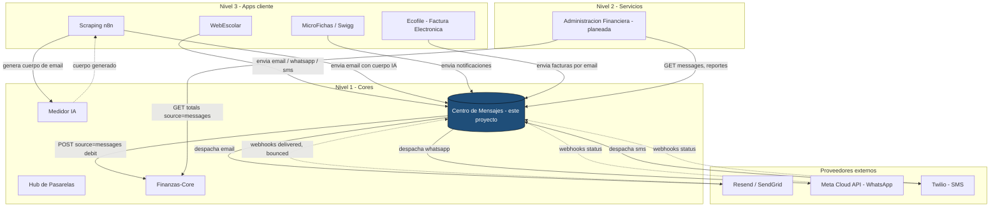
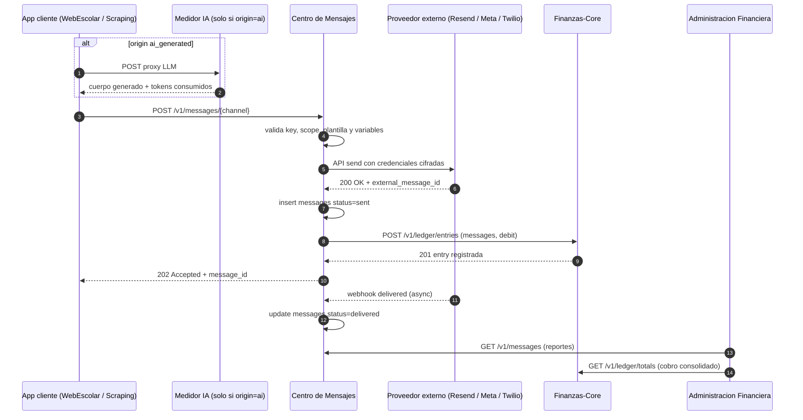

# Centro de Mensajes

**API multi-canal que envía, registra y cobra cada mensaje (Email, WhatsApp, SMS) que las apps de Inovaweb mandan a sus usuarios finales**

Documento técnico de proyecto · Inovaweb Soluciones Tecnológicas de México S.A. de C.V. · Versión 0.1.0 · Mayo 2026

---

## Resumen ejecutivo

Centro de Mensajes es la cuarta pieza del Nivel 1 de la plataforma Inovaweb. Funciona como el cartero unificado de la organización: cualquier aplicación (WebEscolar, Scraping, MicroFichas o Ecofile) le entrega un mensaje destinado a un usuario final, especifica el canal (correo electrónico, WhatsApp o SMS), opcionalmente referencia una plantilla previamente registrada, y el centro se encarga de despachar el envío a través del proveedor configurado, registrar el evento con metadatos completos, contar el mensaje contra la cuenta del cliente final y reportar el cargo al Finanzas-Core. El módulo resuelve dos problemas simultáneos: el operativo, eliminando la duplicación de integraciones con proveedores externos (Resend, SendGrid, Twilio, Meta Cloud API) en cada app, y el contable, dándole al área financiera una única fuente de verdad de cuántos mensajes despachó cada cliente, por qué canal y a qué costo. Es la pieza que, junto con Hub de Pasarelas, Medidor IA y Finanzas-Core, completa el catálogo mínimo necesario para construir el módulo de Administración Financiera del Nivel 2. El proyecto inicia su sprint 1 en mayo de 2026 y será desplegado bajo el dominio `mensajes.inovaweb.com.mx` siguiendo el mismo patrón de empaquetamiento, despliegue y seguridad que los otros cores ya operativos.

---

## 1. Introducción

A lo largo de 2025 y la primera mitad de 2026, cada aplicación de Nivel 3 fue agregando capacidades de notificación a sus flujos: WebEscolar manda boletas y avisos a padres por correo y WhatsApp; el motor de Scraping en n8n envía correos personalizados generados con IA; MicroFichas/Swigg notifica suscripciones y recordatorios; Ecofile, en construcción, deberá enviar facturas electrónicas por correo. Cada equipo terminó integrando su propio proveedor de envío (uno con Resend, otro con SendGrid, otro con Twilio para SMS, otro con la Cloud API de WhatsApp Business), manteniendo sus propias plantillas dentro del código de la aplicación, rotando sus propias credenciales y, lo más crítico, sin un mecanismo común para contar cuántos mensajes salieron por cliente final ni para cobrarle ese servicio.

El patrón es conocido en la industria como Communications Platform as a Service o CPaaS interno. Empresas como Twilio Conversations, Postmark, Courier o MagicBell ofrecen este modelo en formato SaaS, abstrayendo a las aplicaciones de los proveedores subyacentes y dejando que el negocio se concentre en el contenido y el destinatario. La decisión arquitectónica de Inovaweb es construir su versión soberana del patrón: un único core en Nivel 1 que aísla la heterogeneidad de los proveedores comerciales, centraliza la administración de plantillas, gobierna el catálogo de credenciales por canal y empaqueta el conteo y la facturación en un solo lugar.

El Centro de Mensajes nace además con un caso especial que el patrón CPaaS estándar no resuelve de forma elegante: la convivencia, dentro del canal de correo, de dos vías de origen radicalmente distintas. Una es la vía clásica de plantilla, donde la aplicación cliente entrega variables y referencia una plantilla pre-registrada. La otra es la vía IA, donde el cuerpo del correo viene íntegramente generado por un modelo de lenguaje (por ejemplo, el motor de Scraping ya usa Medidor IA para construir correos fríos personalizados). Ambas vías deben quedar marcadas de manera distinguible en el registro contable, porque tienen procesos y costos diferentes que el área financiera debe poder reportar por separado.

---

## 2. Objetivos

### 2.1 Objetivo general

Construir una API core multi-canal que despache, registre y cobre cada mensaje saliente de cualquier aplicación de Inovaweb hacia los usuarios finales, abstrayendo la heterogeneidad de proveedores externos, manteniendo un catálogo central de plantillas, garantizando trazabilidad por aplicación, cliente, remitente, destinatario, canal y vía de origen, y reportando los cargos generados al Finanzas-Core como única fuente de verdad contable.

### 2.2 Objetivos específicos

- Exponer un endpoint único de envío por canal (`POST /v1/messages/email`, `/whatsapp`, `/sms`) que acepte el mínimo necesario para despachar (destinatario, plantilla o contenido, variables) y devuelva un identificador interno que la aplicación cliente pueda usar para correlación posterior.
- Mantener un catálogo administrable de credenciales por tenant y por canal, con valores cifrados con AES-256-GCM en base de datos y rotación sin downtime.
- Mantener un catálogo administrable de plantillas pre-aprobadas por canal y por tenant, con variables tipadas, versionado y vigencia temporal.
- Diferenciar de manera explícita la vía de origen del correo (plantilla pre-registrada o cuerpo generado por IA) mediante un campo `origin_kind` que se persiste en el registro de cada mensaje y se reporta por separado al Finanzas-Core.
- Registrar para cada mensaje un conjunto completo de metadatos auditables (aplicación, cliente, servicio, remitente con sus datos del canal, destinatario con sus datos del canal, fecha de envío, status de entrega, pixel de tracking cuando aplique).
- Exponer endpoints de consulta multi-eje para el dueño del proceso (filtros por aplicación, cliente, remitente, fecha, canal) que permitan armar dashboards, conciliar facturación y auditar entregas.
- Emitir un POST al Finanzas-Core por cada mensaje despachado con éxito (`source=messages`, `direction=debit`), con `source_ref` determinista para garantizar idempotencia ante reintentos.
- Operar bajo el mismo modelo de seguridad y despliegue que los otros cores Nivel 1: HTTPS terminado por Caddy compartido, autenticación por API Key con scopes, hashing SHA-256 de las keys, append-only en tablas críticas, despliegue Docker en VPS Contabo.

---

## 3. Planteamiento del problema

### 3.1 Problema a nivel operativo

Hasta la primera mitad de 2026, cada aplicación que necesitaba enviar comunicaciones a usuarios finales lo resolvía a su manera, generando síntomas operativos cada vez más caros de sostener.

- **Duplicación de cuentas con proveedores externos.** Cada app registró su propia cuenta en Resend, SendGrid o Twilio, multiplicando los puntos de facturación externa y dificultando la negociación de volúmenes consolidados con cada proveedor.
- **Rotación dispersa de credenciales.** Cada cambio de API key del proveedor obligaba a coordinarse con varios equipos y a desplegar varios repositorios. Una credencial filtrada de SendGrid o de Twilio era un incidente difícil de contener en tiempos razonables.
- **Plantillas dispersas en código de aplicación.** Las plantillas de correo, los textos de SMS y las variantes de mensajes de WhatsApp vivían dentro del código de cada app, lo que obligaba a desplegar la app entera para corregir una falta de ortografía o ajustar un enlace.
- **Imposibilidad de contar mensajes por cliente final.** Cuando administración necesitaba responder “¿cuántos correos mandó este cliente este mes?” o “¿cuánto le toca pagar por su consumo de WhatsApp?”, la única respuesta era consultar paneles externos de cada proveedor y reconciliar a mano, sin garantía de exactitud.
- **Inconsistencia en la atribución de eventos de tracking.** Los pixels de apertura y los clics de enlaces se recibían en endpoints distintos según la app, sin un esquema común para asociarlos al cliente final ni al servicio de origen.

### 3.2 Problema a nivel de integración

Desde la arquitectura, la situación era equivalente al fan-out clásico que ya se había resuelto con Hub de Pasarelas para los pagos y con Medidor IA para el consumo de modelos de lenguaje, pero esta vez en el dominio de las comunicaciones salientes.

- **Acoplamiento N a M.** Cuatro aplicaciones cliente actuales (WebEscolar, Scraping, MicroFichas, Ecofile) por al menos tres canales (Email, WhatsApp, SMS) por al menos dos proveedores potenciales por canal generaban una matriz de integraciones imposible de gobernar centralmente.
- **Lógica de cobro de mensajería filtrándose hacia las apps.** Cada app necesitaba conocer sus propias tarifas, su propia política de fallback ante errores transitorios del proveedor y sus propias reglas de reintento, mezclando concerns de comunicaciones con concerns de negocio.
- **Imposibilidad de cambiar de proveedor sin tocar a los consumidores.** Migrar Email de Resend a SendGrid o de SendGrid a Postmark, por ejemplo, implicaba reescribir el flujo de envío en cada aplicación cliente.
- **Pérdida de gobernanza multi-tenant.** Cada aplicación interpretaba a su manera el concepto de cliente final, lo que abría la puerta a fugas accidentales de información entre tenants si dos apps llegaban a compartir credenciales por error.
- **Ausencia de canal contable común.** Sin un único punto que emitiera al Finanzas-Core la línea contable por cada mensaje, era imposible cerrar el círculo de cobro al cliente por el servicio de mensajería.

---

## 4. Descripción del proyecto

### 4.1 Naturaleza del sistema

Centro de Mensajes es una API HTTP construida en Python 3.12 sobre FastAPI, persistida en PostgreSQL 16 con SQLAlchemy 2 en modo asíncrono y el driver psycopg 3. Las llamadas salientes a proveedores externos (Resend para correo, Meta Cloud API para WhatsApp Business, Twilio para SMS) se realizan con cliente HTTP asíncrono httpx. Las credenciales de cada proveedor por tenant se cifran con AES-256-GCM antes de tocar disco. El servicio se empaqueta en una imagen Docker multi-stage basada en `python:3.12-slim`, se orquesta con docker-compose junto a su propia instancia dedicada de PostgreSQL, se expone en el puerto 8005 del host del VPS Contabo (los puertos 8000 a 8004 están ocupados por servicios previos) y se publica al exterior mediante el Caddy compartido del stack n8n, que termina HTTPS bajo el dominio `mensajes.inovaweb.com.mx`. No expone puerto de base de datos al exterior, no tiene interfaz gráfica propia y se administra exclusivamente vía HTTP autenticado.

### 4.2 Funciones principales

- **Despacho multi-canal con interfaz común**: tres endpoints simétricos (`POST /v1/messages/email`, `/v1/messages/whatsapp`, `/v1/messages/sms`) aceptan el destinatario, opcionalmente la referencia a una plantilla pre-registrada, las variables que la plantilla necesita, y los metadatos de aplicación, cliente y servicio. El centro resuelve el proveedor configurado para el tenant, ejecuta el despacho asíncrono, persiste el registro y devuelve el identificador interno del mensaje.
- **Catálogo administrable de plantillas**: endpoints administrativos (`POST /admin/v1/templates`, `GET /admin/v1/templates`, `PATCH /admin/v1/templates/{id}`) permiten registrar plantillas con su canal, sus variables tipadas y su versión. Cada plantilla se versiona internamente y conserva sus versiones anteriores, de modo que un mensaje enviado bajo la versión 3 se puede auditar incluso después de que la versión 4 esté publicada.
- **Catálogo administrable de credenciales por canal**: endpoints administrativos permiten registrar y rotar credenciales de Resend, SendGrid, Meta Cloud API, Twilio o cualquier otro proveedor que se agregue. Las credenciales se cifran con AES-256-GCM, jamás se exponen en respuestas y solo se desencriptan en memoria al momento del despacho.
- **Diferenciación obligatoria de origen para correo**: cada mensaje de correo lleva un campo `origin_kind` con dos valores válidos, `template` y `ai_generated`. La vía `template` exige `template_id` y `variables`. La vía `ai_generated` exige `subject` y `body_html` o `body_text` directos, generados aguas arriba por el consumidor (típicamente vía Medidor IA). Esto permite reportar al Finanzas-Core dos sub-líneas contables separadas dentro del mismo `source=messages` y diferenciar el cobro al cliente.
- **Tracking opcional por pixel y enlaces**: cuando el correo se envía con la opción de tracking activada, el centro inserta automáticamente un pixel transparente apuntando a `/v1/track/email/open/{message_id}` y reescribe los enlaces para pasar por `/v1/track/email/click/{message_id}?u=...`. Los eventos de apertura y click se persisten asociados al mensaje y son consultables vía API.
- **Endpoint unificado de webhooks de proveedores**: una ruta única `/webhooks/{provider}` recibe los eventos asíncronos de cada proveedor (delivered, bounced, dropped, opened, clicked), valida la firma cuando el proveedor la ofrece, traduce el evento al lifecycle interno (`queued | sent | delivered | failed | bounced`) y actualiza el registro del mensaje.
- **Conteo y reporte al Finanzas-Core**: al confirmar el despacho exitoso de cualquier mensaje, el centro emite un POST al ledger consolidado (`source=messages`, `direction=debit`, monto según el catálogo de precios del canal) con `source_ref` determinista del patrón `msg-<channel>-<message_id>`. La idempotencia del Finanzas-Core garantiza que reintentos no generen doble cobro.
- **Consulta multi-eje para el dueño del proceso**: endpoints de lectura (`GET /v1/messages`) permiten filtrar por aplicación, cliente, remitente, destinatario, canal, status, vía de origen, rango de fechas y presencia de eventos de tracking. La paginación admite hasta quinientos elementos por página.
- **Aislamiento multi-tenant estricto**: toda consulta y todo despacho filtra por el `tenant_id` que se resuelve desde la API key entrante. El cuerpo de la petición jamás se considera fuente de verdad para este campo.

### 4.3 Convenciones técnicas firmes

- Los montos en el catálogo de precios por canal se expresan siempre en centavos enteros (BIGINT), nunca en coma flotante.
- Las API keys del centro se almacenan exclusivamente como hash SHA-256; el plaintext jamás queda en base ni en logs.
- Los teléfonos para WhatsApp y SMS se almacenan siempre en formato E.164 con prefijo de país, normalizados al momento de ingreso para evitar inconsistencias regionales.
- Los identificadores de mensajes son UUID generados server-side, no del cliente, para evitar colisiones y enumeración.
- El catálogo de canales es cerrado en el código (`email`, `whatsapp`, `sms`) y se extiende solo por release del propio centro; las redes sociales (Messenger, Instagram) entran como canales adicionales en fase posterior.
- El lifecycle de cada mensaje es `queued → sent → (delivered | failed | bounced)`, sin transiciones reversibles; la única forma de revertir un cobro contable ya emitido es insertar una compensación en el Finanzas-Core con `source_ref` de patrón `msg-<channel>-<message_id>-reversal`.
- Las plantillas son inmutables una vez referenciadas por un mensaje; las correcciones se hacen creando una nueva versión, no modificando la versión publicada.

---

## 5. Capa operativa e interconexión

### 5.1 Ubicación en la arquitectura Inovaweb

Centro de Mensajes vive en el Nivel 1 de la arquitectura Inovaweb, junto a Medidor IA, Hub de Pasarelas y Finanzas-Core. El Nivel 1 reúne las APIs core de infraestructura, especializadas, sin lógica de negocio vertical y reutilizables por cualquier aplicación. El Nivel 2 hospeda los servicios de orquestación y dashboards, donde residirá Administración Financiera. El Nivel 3 contiene las aplicaciones que resuelven un problema vertical concreto: WebEscolar, Scraping en n8n, MicroFichas/Swigg y Ecofile. Las apps de Nivel 3 son las únicas que tienen razones de negocio para enviar mensajes a usuarios finales; los cores Nivel 1 no son consumidores naturales del Centro de Mensajes, con la excepción de que el propio Centro reportará sus cargos al Finanzas-Core. Administración Financiera de Nivel 2 será consumidor de lectura para construir dashboards y reportes de mensajería por cliente.

### 5.2 Diagrama de la arquitectura e interconexiones



*Figura 1. Capas operativas e interconexiones entre módulos.*

### 5.3 Flujo de información típico

1. Una aplicación de Nivel 3 (por ejemplo, WebEscolar) decide enviar un correo a un padre de familia con la boleta del mes.
2. WebEscolar arma el cuerpo con los datos necesarios (nombre del alumno, periodo, calificaciones) y realiza un `POST /v1/messages/email` al Centro de Mensajes con la referencia a una plantilla previamente registrada y las variables a hidratar.
3. El Centro valida la API key entrante, resuelve el tenant, verifica el scope `messages:write`, busca la plantilla referenciada y comprueba que las variables esperadas estén presentes y bien tipadas.
4. El Centro inserta el registro del mensaje en estado `queued`, resuelve las credenciales cifradas del proveedor configurado para correo en ese tenant, las desencripta en memoria y dispara el despacho asíncrono vía httpx.
5. El proveedor (Resend o SendGrid) acepta el mensaje y devuelve un identificador externo; el Centro actualiza el registro a estado `sent`, guarda el identificador externo y emite un POST al Finanzas-Core con `source=messages`, `direction=debit`, monto según el catálogo, `source_ref=msg-email-<message_id>`.
6. Más tarde, el proveedor envía vía webhook el evento `delivered`, `bounced` o `dropped`; el Centro recibe el webhook en `/webhooks/{provider}`, valida la firma cuando aplique, actualiza el estado del mensaje y persiste los timestamps de los eventos.
7. Si el correo se envió con tracking activado, eventuales aperturas (pixel) y clicks en enlaces se reciben en endpoints internos del Centro y se asocian al registro del mensaje.
8. WebEscolar puede consultar en cualquier momento `GET /v1/messages/{id}` para conocer el estado actual; Administración Financiera puede consultar `GET /v1/messages?app=webescolar&from=...&to=...` para armar reportes por cliente.

---

## 6. Interconexión detallada con los demás cores

### 6.1 Interconexión con el Medidor IA (core de medición y wallets)

**Naturaleza de la relación**: indirecta y descendente desde la app cliente. El Centro de Mensajes no llama nunca al Medidor IA en su flujo principal. La relación surge en el caso especial del correo generado por IA: la aplicación de Nivel 3 (por ejemplo, el motor de Scraping) primero invoca al Medidor IA para generar el cuerpo del correo personalizado, paga ese consumo de tokens contra su wallet del Medidor, y a continuación envía el cuerpo ya construido al Centro de Mensajes con `origin_kind=ai_generated`. El Centro persiste esta marca, lo que permite al Finanzas-Core reportar las dos líneas contables (consumo de IA vía Medidor, despacho del mensaje vía Centro) por separado, aunque conceptualmente pertenezcan al mismo flujo de negocio.

**Protocolo y transporte**: HTTPS, REST, JSON sobre TLS 1.3. La app cliente usa httpx asíncrono para hablar primero con `medidor.inovaweb.com.mx` y luego con `mensajes.inovaweb.com.mx`.

**Autenticación**: cada conexión usa su propia API key. La app cliente posee una key para el Medidor (Bearer token con scope cliente) y otra key distinta para el Centro de Mensajes (header `X-API-Key` con scope `messages:write`). El Centro de Mensajes no autentica contra el Medidor.

**Endpoints involucrados**: el Centro de Mensajes no consume endpoints del Medidor; la relación es del lado de la app cliente, que ya conoce el contrato del Medidor IA.

**Esquema mínimo del payload generado por IA que la app cliente entrega al Centro**:

| Campo | Tipo | Descripción |
|---|---|---|
| `origin_kind` | string | Constante `ai_generated` |
| `subject` | string | Asunto del correo, generado por el modelo o por la app |
| `body_html` | string | Cuerpo HTML completo del correo |
| `body_text` | string | Versión texto plano del cuerpo |
| `meta.medidor_event_id` | string | Identificador del evento de cobro en el Medidor, para correlación contable |
| `meta.model` | string | Modelo de IA usado, por ejemplo `deepseek-chat` |
| `meta.tokens_in` | integer | Tokens de entrada consumidos |
| `meta.tokens_out` | integer | Tokens de salida consumidos |

**Llave de idempotencia**: el Centro construye su propio identificador de mensaje UUID server-side y lo usa para construir `source_ref=msg-email-<message_id>` al reportar al Finanzas-Core. La correlación contra el consumo del Medidor se mantiene en el campo `meta.medidor_event_id` del registro del mensaje.

**Política de reintentos**: no aplica directamente al Medidor desde el Centro, dado que no hay llamada saliente. La app cliente es responsable de reintentar contra el Medidor si la generación falla y, una vez exitosa, de reintentar contra el Centro si el despacho falla.

**Trazabilidad**: la dupla `(meta.medidor_event_id, message_id)` queda persistida en la tabla `messages` del Centro y permite, en una consulta de auditoría, reconstruir el costo total de un correo IA sumando lo cobrado por el Medidor (consumo de tokens) más lo cobrado por el Centro (despacho del mensaje).

**Ejemplo de petición de la app cliente al Centro tras haber generado el cuerpo vía Medidor**:

```bash
curl -X POST https://mensajes.inovaweb.com.mx/v1/messages/email \
  -H "X-API-Key: msg_scraping_xxxxxxxxxxxxxxxxxxxx" \
  -H "Content-Type: application/json" \
  -d '{
    "app_id": "scraping",
    "client_id": "client-uuid-001",
    "service_id": "envio-frio",
    "origin_kind": "ai_generated",
    "from": { "email": "envios@inovaweb.com.mx", "name": "Inovaweb" },
    "to": { "email": "destino@ejemplo.com", "name": "Juan Perez" },
    "subject": "Propuesta personalizada",
    "body_html": "<p>Hola Juan, ...</p>",
    "body_text": "Hola Juan, ...",
    "tracking": { "open": true, "click": true },
    "meta": {
      "medidor_event_id": "evt_xyz789",
      "model": "deepseek-chat",
      "tokens_in": 2629,
      "tokens_out": 1197
    }
  }'
```

### 6.2 Interconexión con Administración Financiera (servicio nivel 2)

**Naturaleza de la relación**: el Centro de Mensajes es proveedor de lectura para Administración Financiera. Hoy ese servicio no existe; el contrato esperado se documenta para que su construcción no requiera cambios en el Centro.

**Datos expuestos hacia el dashboard financiero**: listado paginado de mensajes con todos sus metadatos, agregados por canal, por cliente y por aplicación dentro de una ventana temporal, conteos absolutos y montos sumados, status de entrega y, cuando aplica, tasa de apertura y de clic para los canales que lo permiten.

**Endpoints de lectura previstos**:

- `GET /v1/messages?app=...&client=...&channel=...&from_ts=...&to_ts=...&limit=...&offset=...` para el listado paginado con filtros multi-eje.
- `GET /v1/messages/{id}` para el detalle de un mensaje con todos sus eventos de tracking.
- `GET /v1/reports/usage?from_ts=...&to_ts=...&group_by=client,channel` para agregados pre-calculados orientados a facturación.

**Filtros típicos**: aplicación emisora, cliente final, remitente, destinatario, canal (`email`, `whatsapp`, `sms`), vía de origen (`template`, `ai_generated`), status (`queued`, `sent`, `delivered`, `failed`, `bounced`), rango de fechas sobre `sent_at`.

**Frecuencia esperada del consumo**: combinación de lecturas on-demand desde el dashboard cuando un operador navega los tableros, batch nocturno para refrescar vistas materializadas internas de Administración Financiera y consultas puntuales durante la generación mensual de facturas por mensajería.

**Permisos y scopes**: Administración Financiera utilizará una API key dedicada con scope `messages:read:financial`, distinta del scope operativo `messages:write` usado por las apps cliente, lo que evita riesgo de despacho accidental.

**Riesgos de acoplamiento y mitigaciones**: el dashboard financiero no debe escribir en la base del Centro. Cualquier corrección manual entra por procedimientos administrativos del propio Centro, no por mutaciones cruzadas. Esto preserva la naturaleza append-only de las tablas de mensajes. Si en el futuro el volumen de mensajes crece a varios millones, se introducirán vistas materializadas y particionamiento mensual sin alterar la interfaz pública.

### 6.3 Interconexión con el Centro de Mensajes mismo

Esta sección no aplica para este documento, dado que el proyecto descrito es el propio Centro de Mensajes. La sección equivalente correspondería a describir la cara expuesta hacia los consumidores, la cual ya se cubrió en las secciones 4 (Descripción del proyecto), 5 (Capa operativa e interconexión) y la sección presente. La distinción entre vía `template` y vía `ai_generated` para correo es el contrato fundamental que cualquier consumidor debe respetar al integrar.

### 6.4 Interconexión con las pasarelas externas (proveedores de mensajería)

**Naturaleza de la relación**: el Centro de Mensajes es cliente saliente hacia los proveedores comerciales de mensajería (Resend o SendGrid para correo, Meta Cloud API para WhatsApp, Twilio para SMS) y receptor entrante de los webhooks que esos proveedores emiten cuando un mensaje cambia de estado. La relación es estructuralmente análoga a la del Hub de Pasarelas con las pasarelas de pago.

**Catálogo de proveedores previstos**:

| Slug interno | Estado | Canales soportados | Endpoint base | Tipo de credencial |
|---|---|---|---|---|
| `resend` | planeado, primera opción | Email transaccional | api.resend.com | API key + dominio verificado |
| `sendgrid` | planeado, alternativa | Email transaccional | api.sendgrid.com | API key + dominio verificado |
| `meta_whatsapp` | planeado | WhatsApp Business | graph.facebook.com | Access token + phone number ID |
| `twilio` | planeado | SMS, WhatsApp como alternativa | api.twilio.com | Account SID + Auth token + Messaging Service SID |

**Resolución dinámica de proveedor**: cada tenant tiene un registro en `tenant_channel_provider` que indica qué proveedor atiende cada canal. Una fábrica interna instancia la implementación concreta de la interfaz `MessageProvider` correspondiente al slug configurado y delega el flujo. La configuración por tenant se almacena cifrada con AES-256-GCM en `tenant_channel_credentials`.

**Contrato común de la interfaz interna `MessageProvider`**: toda implementación expone los métodos `send_email`, `send_whatsapp`, `send_sms` (según los canales que soporte), `verify_webhook_signature` y `parse_event`. Los métodos de envío reciben los datos normalizados del mensaje y devuelven el identificador externo asignado por el proveedor o levantan una excepción tipada. Los métodos de webhook reciben el payload crudo y devuelven el evento traducido al lifecycle interno del Centro.

**Flujo de webhooks entrantes**: ruta única `/webhooks/{provider}`, validación de firma cuando el proveedor la ofrece (Resend usa svix; Meta usa app secret HMAC; Twilio usa firma X-Twilio-Signature), mapeo del evento externo al lifecycle interno (`sent → delivered | failed | bounced`), idempotencia por identificador externo único del mensaje.

**Política de errores**: si el proveedor responde con un error transitorio (timeout, 5xx, throttling), el Centro encola el mensaje en una tabla de pendientes y un job interno lo reintenta cada minuto hasta un máximo de ocho intentos; tras agotarlos, el mensaje queda en estado `failed` con razón persistida. Si el proveedor responde con un error definitivo (credenciales inválidas, destinatario malformado), el mensaje queda inmediatamente en estado `failed`, no se reintenta y no se emite cargo al Finanzas-Core.

**Ejemplo de webhook entrante desde Resend para un evento `email.delivered`**:

```http
POST /webhooks/resend HTTP/1.1
Host: mensajes.inovaweb.com.mx
Content-Type: application/json
svix-id: msg_2abc
svix-timestamp: 1716643211
svix-signature: v1,abcdef1234567890

{
  "type": "email.delivered",
  "created_at": "2026-05-25T14:30:11Z",
  "data": {
    "email_id": "re_external_xyz",
    "to": "destino@ejemplo.com",
    "subject": "Propuesta personalizada"
  }
}
```

El Centro valida la firma `svix-signature`, localiza el mensaje por su identificador externo `re_external_xyz`, actualiza su estado a `delivered`, persiste el timestamp del evento y, si el cargo al Finanzas-Core no se había emitido aún (por una política conservadora de cobrar solo a la entrega confirmada), lo emite ahora.

### 6.5 Interconexión con Finanzas-Core

**Naturaleza de la relación**: el Centro de Mensajes es emisor hacia el ledger consolidado. Por cada mensaje despachado con éxito (estado `sent` o `delivered`, según política configurada), el Centro emite un POST al Finanzas-Core que registra el cargo en la columna `messages` de la contabilidad del tenant.

**Protocolo y transporte**: HTTPS, REST, JSON sobre TLS 1.3, con cliente httpx asíncrono.

**Autenticación**: header `X-API-Key` con la key dedicada del Centro al ledger, etiquetada `core-messages` y con scope `ledger:write`. La key se almacena cifrada en el `.env` del Centro y se carga en memoria al inicio del proceso.

**Endpoint invocado**: `POST /v1/ledger/entries` con el cuerpo estándar del Finanzas-Core.

**Esquema del payload**:

| Campo | Tipo | Descripción |
|---|---|---|
| `source_slug` | string | Constante `messages` |
| `source_ref` | string | Patrón `msg-<channel>-<message_id>`, idempotente |
| `direction` | string | Constante `debit` |
| `amount_cents` | integer | Precio del canal según catálogo interno del Centro, en centavos |
| `currency` | string | Moneda configurada para el tenant, típicamente `MXN` |
| `occurred_at` | datetime | Timestamp del despacho exitoso |
| `description` | string | Texto humano: canal, destinatario abreviado, plantilla u origen |
| `meta` | object | `app_id`, `client_id`, `service_id`, `template_id` o `origin_kind=ai_generated`, `external_message_id` del proveedor |

**Llave de idempotencia**: `source_ref=msg-<channel>-<message_id>`. El `message_id` es UUID generado por el Centro al insertar el registro, lo que garantiza unicidad. Reintentar el POST con el mismo `source_ref` devolverá `idempotent_replay=true` y no duplicará el cargo.

**Política de reintentos**: ante fallos transitorios contra el Finanzas-Core, el cargo queda en estado pendiente local y un job interno lo reintenta cada sesenta segundos hasta ocho intentos; tras agotarlos, queda en estado `manual` para revisión humana.

**Trazabilidad**: cada mensaje persiste localmente las columnas `ledger_request_id`, `ledger_status` y `ledger_last_attempt_at`, accesibles desde el endpoint `GET /v1/messages/{id}`.

**Ejemplo de petición al Finanzas-Core**:

```bash
curl -X POST https://finanzas.inovaweb.com.mx/v1/ledger/entries \
  -H "X-API-Key: fz_messages_xxxxxxxxxxxxxxxxxxxx" \
  -H "Content-Type: application/json" \
  -d '{
    "source_slug": "messages",
    "source_ref": "msg-email-018e2c7b-a1d4-7c2e-9f3a-1234567890ab",
    "direction": "debit",
    "amount_cents": 50,
    "currency": "MXN",
    "occurred_at": "2026-06-01T15:00:00Z",
    "description": "Email enviado a destino@ejemplo.com via plantilla boleta-mensual",
    "meta": {
      "app_id": "webescolar",
      "client_id": "escuela-123",
      "service_id": "boleta-mensual",
      "template_id": "tpl-boleta-mensual-v3",
      "external_message_id": "re_external_xyz",
      "origin_kind": "template"
    }
  }'
```

### 6.6 Resumen visual de las interconexiones



*Figura 2. Secuencia de interconexión entre cores ante el envío de un mensaje desde una app cliente.*

---

## 7. Casos de uso planeados

### 7.1 Caso 1: WebEscolar envía boleta mensual por correo

WebEscolar, ERP escolar, debe enviar a cada padre de familia la boleta del periodo con calificaciones y observaciones. Hoy se hace por correo desde la propia aplicación. Cuando Centro de Mensajes esté operativo, el flujo será: WebEscolar arma las variables (nombre del alumno, periodo, lista de materias con calificaciones, observaciones), referencia la plantilla pre-registrada `tpl-boleta-mensual-v3`, especifica el destinatario y dispara el POST al Centro. El Centro hidrata la plantilla, despacha vía Resend o SendGrid según el tenant, registra el envío con `origin_kind=template`, espera el webhook de entrega y, una vez confirmada, emite el cargo de cincuenta centavos al Finanzas-Core. Para una escuela mediana con quinientos alumnos, esto generará quinientos cargos al mes en el ledger, sumando veinticinco pesos mensuales por concepto de boletas, separados claramente en los reportes de Administración Financiera.

### 7.2 Caso 2: Scraping envía correo frío personalizado generado por IA

El motor de Scraping en n8n genera correos personalizados a contactos de universidades. Hoy llama directamente al Medidor IA para construir el cuerpo y luego usa una integración propia para enviarlo. Cuando Centro de Mensajes esté operativo, el flujo será: el workflow llama primero al Medidor IA para generar el cuerpo del correo (consumiendo tokens y pagando al Medidor con su wallet), captura el cuerpo y los metadatos de tokens, y a continuación hace un POST al Centro con `origin_kind=ai_generated`, pasando el cuerpo HTML y texto plano ya construidos más los metadatos del evento del Medidor para correlación contable. El Centro despacha vía proveedor configurado, registra el mensaje con la marca `ai_generated` y emite el cargo al Finanzas-Core. El cliente final verá en su factura dos líneas separadas: una por consumo de IA cobrada por el Medidor y otra por despacho de mensajería cobrada por el Centro, ambas trazables a la misma operación de negocio mediante la dupla `(medidor_event_id, message_id)`.

### 7.3 Implicación de los casos

La separación de las dos vías de correo (`template` y `ai_generated`) permite al área financiera responder con precisión la pregunta operativa más común: cuánto del costo de comunicaciones del cliente corresponde a notificaciones rutinarias (plantillas) y cuánto a comunicaciones inteligentes (IA). Esto es indispensable para diseñar planes comerciales con precios diferenciados por tipo de mensaje, dado que el costo unitario de un correo plantilla y el de un correo IA son órdenes de magnitud distintos por el componente de tokens consumidos aguas arriba.

---

## 8. Beneficios de la segmentación y el empaquetamiento de cores

- **Asignación clara de responsabilidades**: Centro de Mensajes hace una sola cosa, despachar comunicaciones salientes y contabilizarlas. Las apps de Nivel 3 se concentran en su lógica de negocio sin tener que conocer las particularidades de Resend o Twilio.
- **Aislamiento de proveedores externos**: cambiar de Resend a SendGrid o de Twilio a Meta Cloud API no requiere modificar a las apps cliente; solo se actualiza la configuración del tenant en el Centro y se rota la credencial.
- **Despliegues independientes**: una corrección en el Centro no requiere reiniciar Medidor IA, Hub de Pasarelas ni Finanzas-Core. Cada core tiene su propio repositorio, su propia base y su propio ciclo de release.
- **Auditoría centralizada de comunicaciones**: toda comunicación saliente queda registrada en un solo lugar con un esquema consistente, lo que habilita auditorías regulatorias y respuestas rápidas a reclamos de usuarios finales sobre mensajes recibidos o no recibidos.
- **Reutilización transversal entre apps**: una única instancia del Centro sirve a WebEscolar, Scraping, MicroFichas y Ecofile, además de cualquier app futura. No se replica esfuerzo de integración por cada nuevo producto vertical.
- **Cobranza consolidada al cliente final**: al emitir cada cargo al Finanzas-Core con metadatos completos, Administración Financiera puede construir la factura mensual del cliente sumando lo gastado en mensajería sin tener que consultar a Resend o Twilio por separado.
- **Gobernanza unificada de plantillas**: el catálogo central de plantillas elimina las inconsistencias de redacción entre apps y permite hacer cambios masivos (por ejemplo, ajustar la firma corporativa en todas las plantillas) sin desplegar cada aplicación cliente.
- **Capacidad de extensión a nuevos canales**: agregar Messenger, Instagram, Push notifications o cualquier canal futuro consiste en implementar la interfaz `MessageProvider` para el nuevo canal y añadir el endpoint correspondiente, sin tocar a los consumidores ni al resto de la plataforma.

---

## 9. Manual técnico para equipos de desarrollo

### 9.1 Recursos publicados

- API en producción (planeado): [https://mensajes.inovaweb.com.mx](https://mensajes.inovaweb.com.mx)
- Documentación interactiva Swagger UI (planeado): [https://mensajes.inovaweb.com.mx/docs](https://mensajes.inovaweb.com.mx/docs)
- Documentación interactiva ReDoc (planeado): [https://mensajes.inovaweb.com.mx/redoc](https://mensajes.inovaweb.com.mx/redoc)
- Spec OpenAPI cruda (planeado): [https://mensajes.inovaweb.com.mx/openapi.json](https://mensajes.inovaweb.com.mx/openapi.json)
- Repositorio GitHub (planeado): [https://github.com/InovawebSoluciones/inovaweb-centro-mensajes](https://github.com/InovawebSoluciones/inovaweb-centro-mensajes)

### 9.2 Autenticación

Toda petición autenticada requiere el header `X-API-Key` con el valor en texto plano de una API key emitida para el tenant correspondiente. El servidor calcula SHA-256 sobre el valor recibido y lo compara contra el hash almacenado en la tabla `api_keys`. El identificador de tenant se resuelve siempre desde la API key, jamás desde el cuerpo de la petición.

Scopes previstos:

- `messages:write` para emitir POST a `/v1/messages/{channel}`.
- `messages:read` para listar y consultar mensajes propios del tenant.
- `messages:read:financial` para Administración Financiera, agrega capacidad de consultar reportes agregados.
- `admin:templates` para el CRUD de plantillas vía endpoints administrativos.
- `admin:credentials` para el CRUD de credenciales de proveedor por tenant.
- `*` para la key maestra de administración interna.

### 9.3 Inventario de claves o credenciales en producción (a emitir)

| Etiqueta | Scope | Propósito |
|---|---|---|
| `admin-master` | `*` | Bootstrap del sistema, administración general |
| `app-webescolar` | `messages:write`, `messages:read` | Envío y consulta desde WebEscolar |
| `app-scraping` | `messages:write`, `messages:read` | Envío desde workflows n8n del proyecto Scraping |
| `app-microfichas` | `messages:write`, `messages:read` | Envío desde MicroFichas/Swigg |
| `app-ecofile` | `messages:write`, `messages:read` | Envío de facturas electrónicas desde Ecofile |
| `admin-financiera` | `messages:read:financial` | Lectura agregada para dashboards |
| `core-messages-to-ledger` | (en Finanzas-Core: `ledger:write`) | Llave que usa el Centro para reportar al ledger |

Los valores en texto plano viven en el password manager corporativo. La base de datos solo persiste el hash SHA-256 de cada key.

### 9.4 Endpoints principales con ejemplos

Envío de correo con plantilla pre-registrada:

```http
POST /v1/messages/email HTTP/1.1
Host: mensajes.inovaweb.com.mx
X-API-Key: msg_webescolar_xxxxxxxxxxxxxxxxxxxx
Content-Type: application/json

{
  "app_id": "webescolar",
  "client_id": "escuela-123",
  "service_id": "boleta-mensual",
  "origin_kind": "template",
  "template_id": "tpl-boleta-mensual-v3",
  "from": { "email": "noreply@escuela123.inovaweb.com.mx", "name": "Escuela 123" },
  "to": { "email": "padre@ejemplo.com", "name": "Maria Lopez" },
  "variables": {
    "alumno": "Juan Lopez",
    "periodo": "Mayo 2026",
    "materias": [{ "nombre": "Matematicas", "calificacion": 9.2 }]
  },
  "tracking": { "open": true, "click": true }
}
```

Envío de WhatsApp con plantilla:

```http
POST /v1/messages/whatsapp HTTP/1.1
Host: mensajes.inovaweb.com.mx
X-API-Key: msg_webescolar_xxxxxxxxxxxxxxxxxxxx
Content-Type: application/json

{
  "app_id": "webescolar",
  "client_id": "escuela-123",
  "service_id": "recordatorio-pago",
  "template_id": "tpl-recordatorio-pago-v2",
  "from_phone_id": "+5215555000001",
  "to_phone": "+5215512345678",
  "variables": {
    "alumno": "Juan Lopez",
    "monto": "1500.00",
    "fecha_limite": "2026-06-05"
  }
}
```

Envío de SMS:

```http
POST /v1/messages/sms HTTP/1.1
Host: mensajes.inovaweb.com.mx
X-API-Key: msg_webescolar_xxxxxxxxxxxxxxxxxxxx
Content-Type: application/json

{
  "app_id": "webescolar",
  "client_id": "escuela-123",
  "service_id": "alerta-puerta",
  "from_phone_id": "+5215555000001",
  "to_phone": "+5215512345678",
  "message": "Su hijo Juan ha registrado entrada a las 07:42"
}
```

Consulta del estado de un mensaje:

```bash
curl -sS https://mensajes.inovaweb.com.mx/v1/messages/<message_id> \
  -H "X-API-Key: msg_webescolar_xxxxxxxxxxxxxxxxxxxx" | python3 -m json.tool
```

Listado paginado para reportes financieros:

```bash
curl -sS "https://mensajes.inovaweb.com.mx/v1/messages?app=webescolar&channel=email&from_ts=2026-05-01T00:00:00Z&to_ts=2026-06-01T00:00:00Z&limit=100" \
  -H "X-API-Key: msg_admin_financiera_xxxxxxxxxxxxxxxxxxxx" | python3 -m json.tool
```

### 9.5 Onboarding paso a paso

1. Solicitar al equipo de operaciones la emisión de una API key dedicada al servicio o app que se va a integrar, indicando los scopes mínimos (`messages:write` para emisores, `messages:read` para consulta del propio tenant).
2. Guardar la API key en el password manager corporativo y declararla como variable de entorno secreta (por ejemplo, `MESSAGES_API_KEY`) en el `.env` del servicio consumidor, con el `.env` excluido de control de versiones.
3. Coordinar con el equipo administrativo el alta de las plantillas necesarias en el catálogo central, especificando el canal, las variables tipadas y la versión inicial.
4. Para WhatsApp y SMS, registrar los teléfonos remitentes en formato E.164 con prefijo de país, validando previamente que la cuenta del proveedor tenga esos números aprobados.
5. Para correo, verificar que el dominio remitente esté configurado con SPF, DKIM y DMARC, y que esté validado en la cuenta del proveedor (Resend o SendGrid).
6. Implementar el cliente HTTP en la app cliente con manejo correcto de los códigos 202 (aceptado para despacho), 400 (validación de payload), 401, 403, 422, 429, 500 y 503.
7. Implementar el job de reintento en segundo plano para fallos transitorios, con backoff exponencial y promoción a revisión manual tras N intentos.
8. Documentar la integración en el README del servicio consumidor con un ejemplo de petición real y un enlace a este documento técnico.

### 9.6 Soporte y trazabilidad

Cada petición HTTP recibe un identificador único `X-Request-Id` que se devuelve en los headers de respuesta y se incluye en cada línea de log JSON estructurado emitida por el servicio durante el procesamiento. Esto permite correlacionar end-to-end una petición desde la app cliente, a través de Caddy, hasta las líneas de log del Centro de Mensajes en el VPS y, eventualmente, hasta el registro persistido en la tabla `messages` y la entrada correspondiente en el ledger del Finanzas-Core.

Los logs en producción se acceden vía `docker logs centro_mensajes` en el VPS. La tabla `api_keys` mantiene actualizado el campo `last_used_at` ante cada uso exitoso, permitiendo detectar keys inactivas. Para incidentes, alertas o solicitudes de nuevas API keys, el contacto técnico es [conrado.torres@inovaweb.com.mx](mailto:conrado.torres@inovaweb.com.mx).

---

## 10. Conclusiones y próximos pasos

El Centro de Mensajes completa el catálogo mínimo de cores Nivel 1 que la plataforma Inovaweb necesita para sostener el módulo de Administración Financiera del Nivel 2. Al adoptar el mismo patrón arquitectónico que Medidor IA, Hub de Pasarelas y Finanzas-Core (multi-tenant estricto, autenticación por API key con scopes, persistencia append-only enforced en base, idempotencia por referencia determinista, despliegue Docker tras Caddy compartido), garantiza coherencia operativa y reduce significativamente la curva de aprendizaje para cualquier desarrollador que ya conozca los otros cores.

El roadmap inmediato consiste en construir el scaffolding del proyecto (FastAPI, PostgreSQL, Dockerfile, docker-compose, esquema inicial con tablas `tenants`, `api_keys`, `templates`, `tenant_channel_credentials`, `messages`, `message_events`), implementar los endpoints de despacho para los tres canales con la integración inicial contra Resend para correo, definir las primeras plantillas en colaboración con WebEscolar y Scraping, y desplegar la primera versión en el VPS Contabo bajo `mensajes.inovaweb.com.mx`. En paralelo, conviene definir el catálogo de precios inicial por canal y por tenant, y coordinarse con el equipo de Finanzas-Core para emitir la API key del Centro al ledger con scope `ledger:write`.

En el mediano plazo, los pasos previstos son la incorporación de Meta Cloud API para WhatsApp y de Twilio para SMS, la implementación de los endpoints de tracking con pixel y reescritura de enlaces, la construcción de las vistas materializadas para reportes agregados, la habilitación del módulo de Administración Financiera para consumir lecturas, y eventualmente la extensión a canales adicionales como Messenger e Instagram según prioridad comercial.
